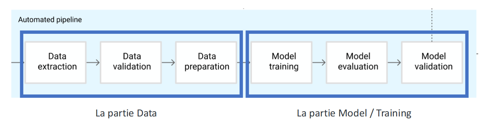

# 🔍 Object Detection Fine-tuning Pipeline

## 🌟 Introduction

Welcome to our smart object detection project! 🎉 This was developed as part of an exciting MLOps class taught by [@picsalex].

🎯 What does it do? We've built a powerful pipeline that trains AI models to recognize everyday items like:

- 🍫 Chocolate treats (Balisto, Bueno, Snickers, Twix)
- 🥜 Granola bars
- 🐟 Tuna tins
- 🧃 Plastic bottles
- And more!

### 🛠️ Tech Stack

- 📸 **Picsellia**: Handles our dataset hosting
- 📊 **MLflow**: Manages our model registry and metadata
  - Uses MySQL for metadata
  - MinIO for artifact storage
- 🚀 **BentoML**: Powers our model serving
- 🐳 **Docker**: Containerizes our entire pipeline

### 💫 Features

- 🖼️ Local inference supports:
  - Static images
  - Video files
  - Real-time camera feed
- 🌐 BentoML deployment (currently supports image inference)

## 📝 Pipeline ML

All the steps of the MLOps pipeline are independently executed sequentially. The data part is done in [pipeline_data.py](https://github.com/Times0/mlops-end-to-end/blob/main/src/data_pipeline.py) and the training part in [training_pipeline.py](https://github.com/Times0/mlops-end-to-end/blob/main/src/training_pipeline.py). Comments are provided in the code to highlight the different steps of the pipeline.


## 🚀 Getting Started

### Prerequisites

- Docker 🐳

### 🛠️ Environment Setup

1. Set up the Python environment:

```shell
pip install uv
uv venv --python=3.11
uv pip install -r requirements.txt
source .venv/bin/activate  # On Windows: .venv\Scripts\activate
```

Now you must set the src/config/.env file. Copy .env.distrib and set the missing variables

We use docker to compartementalize the pieces of the pipeline.
Check if docker is running

````

2. 🐳 Docker Setup
Check Docker status:
```shell
systemctl status docker
````

If Docker isn't running:

```shell
systemctl start docker
```

3. 🚀 Launch the Pipeline
   Start services in background:

```shell
docker compose up --build -d
```

(You can turn down docker with the following command once you are done)
To stop the services:

```shell
docker compose down
```

Tip: Use `-v` flag with `down` command to remove volumes for a fresh start

## 🏃‍♂️ Running the Pipeline

Follow these steps in order:

1. Dataset Preparation
2. Training
3. Local Inference

### 🖥️ Running Options

#### VSCode

Launch directly from the Run section in VSCode

#### Terminal

Set the MLFLOW endpoint URL before running:

Linux:

```shell
MLFLOW_S3_ENDPOING_URL=http://localhost:9000 uv run src/<file.py>
```

Windows:

```powershell
$env:MLFLOW_S3_ENDPOINT_URL="http://localhost:9000"; uv run src/<file.py>
```

### 🚀 Deployment

To serve on bentoml (only for static image inference, not for video or camera use):

```
bentoml cloud login
bentoml build
bentoml serve
```

Test the deployment using `inference_bento` (remember to update the endpoint URL).

## 📝 TODO

- [x] Implement automatic S3 bucket creation
- [ ] docstrings and typehints everywhere ?
- [x] Clean up README
